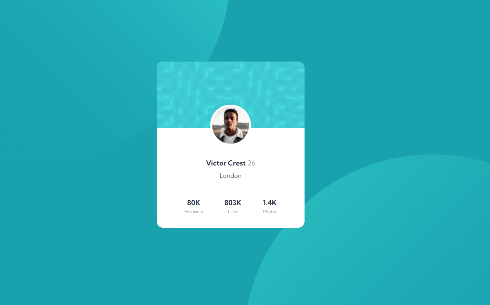

# Frontend Mentor - Profile card component solution

This is a solution to the [Profile card component challenge on Frontend Mentor](https://www.frontendmentor.io/challenges/profile-card-component-cfArpWshJ). Frontend Mentor challenges help you improve your coding skills by building realistic projects. 

### The challenge

- Build out the project to the designs provided

### Screenshot

### Links

- Solution URL: [Click to reach solution](https://www.frontendmentor.io/solutions/profile-card-component-css-flexbox-DA0el2WrZs)
- Live Site URL: [Click to reach live site](https://radiant-elf-5a23c3.netlify.app/)

## My process

### Built with

- Semantic HTML5 markup
- CSS custom properties
- Flexbox
- Mobile-first workflow

### What I learned

During working on this project, I improved my css background-image knowledge.

## Author

- Frontend Mentor - [@nuribugra](https://www.frontendmentor.io/profile/nuribugra)
- Twitter - [@nuribugrademir](https://www.twitter.com/nuribugrademir)

